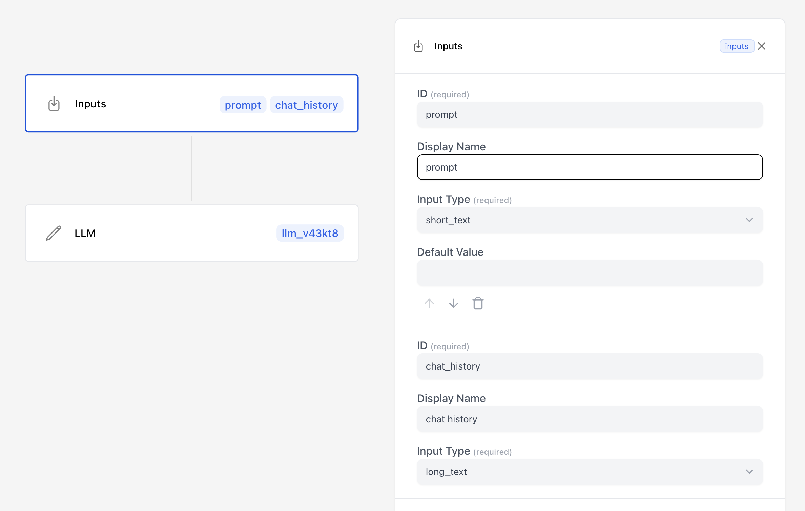
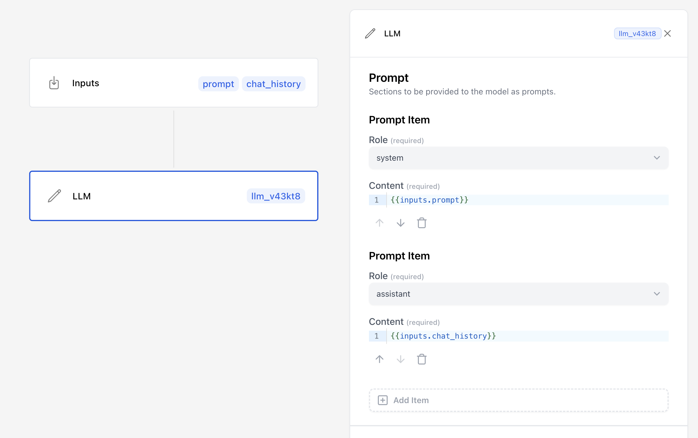

# Scout SDK
This is a [Next.js](https://nextjs.org) project bootstrapped with [`create-next-app`](https://nextjs.org/docs/app/api-reference/cli/create-next-app).
It was created to exemplify simple usage of the javascript sdk supplied by the npm package `scoutos`.

## What?

Utilize an existing workflow from [scoutos.com](https://www.scoutos.com/dashboard/apps), this app shows how you can create a chat bot. 
All your workflow needs, is an LLM block ready to consume user prompts.

#### Getting your Workflow ready

In order to create a chatbot with scout, youll need a workflow that utilizes the Input & LLM block.
This app will pass two data points to the workflow, `prompt` and `chat_history`. These are managed on the Input block.
**The Input Block**
1. You'll need an input to handle user  `prompt` input of type `short_text`. 
2. You'll want a `chat_history` input of type `long_text`.



**The LLM Block**
1. At the very least, your LLM block should have a `user` (role) prompt to consume user input. (This example app uses `{{inputs.prompt}}`)
3. In order for your chatbot to "remember" chat history, your LLM will need a prompt with an `assistant` role. This example app uses `{{inputs.chat_history}}`.
4. Give your chat agent a specialty by setting a `system` prompt on your Workflows `LLM` block.



## Starting this app

#### Setup Env
You'll need to set 3 values in `src/app/page.tsx`:
```
const LLM_BLOCK_ID = 'llm_vj3ffp'
const WORKFLOW_ID = 'app_lk0x1jlls000204sfb3jjq22h'
const SCOUT_API_KEY = 'secret_gf1dZpme3gT5LgWOEiEbLm6Gquf9v4d4Gb-PuTk3vKm'
```

#### Run the app

Install Dependencies:
```bash
npm install
```

Run the development server:
```bash
npm run dev
```

Open [http://localhost:3000](http://localhost:3000) with your browser to see the result.

